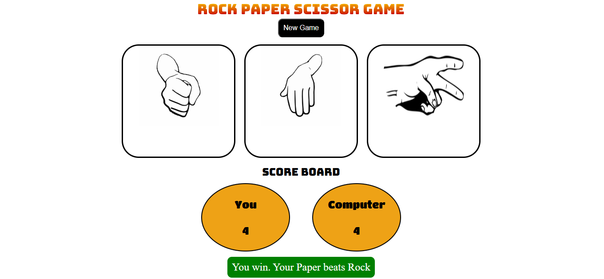

# RockPaperScissorsGame
A simple and fun **Rock Paper Scissors** game built using **JavaScript**, **HTML**, and **CSS**.   Play against the computer and test your luck!


## 🚀 Features

- Interactive UI for selecting Rock, Paper, or Scissors  
- Computer’s choice generated randomly  
- Displays the winner instantly  
- Scoreboard tracking player and computer scores  
- Responsive design for desktop and mobile

---

## 🧠 Game Rules

| Player Choice | Computer Choice | Result        |
|----------------|----------------|----------------|
| Rock           | Scissors       | Player Wins 🏆 |
| Paper          | Rock           | Player Wins 🏆 |
| Scissors       | Paper          | Player Wins 🏆 |
| Same Choice    | Same Choice    | It's a Draw 🤝 |

---

## 💻 Technologies Used

- **HTML5** – Structure  
- **CSS3** – Styling and layout  
- **JavaScript (ES6)** – Game logic  

---

## 🕹️ How to Play

1. Choose **Rock**, **Paper**, or **Scissors** by clicking the corresponding button.  
2. The computer will randomly select one.  
3. The result (Win, Lose, or Draw) will be shown on the screen.  
4. Play as many rounds as you like!

---
# Open index.html in your browser

## 📂 Project Setup

To run the project locally:

```bash
# Clone the repository
git clone https://github.com/NikitaSRane/rock-paper-scissors.git

# Go to the project directory
cd rock-paper-scissors

# Open index.html in your browser


